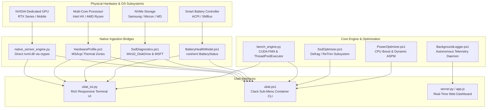
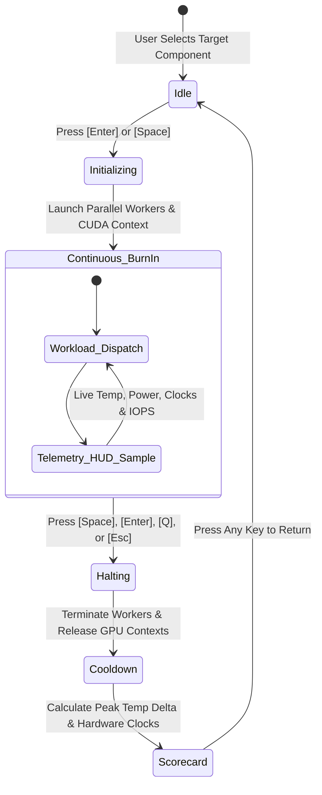
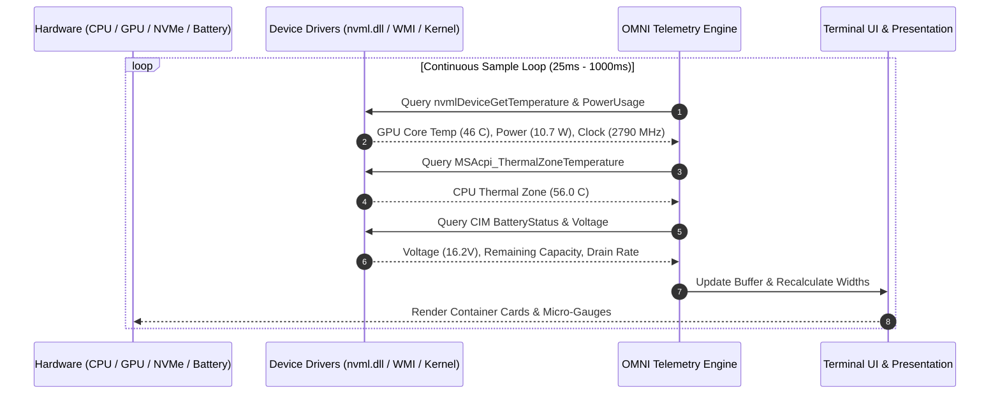

# OMNI - System Hardware Telemetry & Optimization Suite

```
  ========================================================================================
    ___    __  __ _   _ ___   - Hardware Telemetry, Diagnostic & Optimization Suite
   / _ \  |  \/  | \ | |_ _|  - Native Ctypes NVML, ACPI WMI Sensors & CUDA Burn-In
  | | | | | |\/| |  \| || |   - Universal Windows PC Support (HP OMEN, ASUS, Lenovo, Dell)
  | |_| | | |  | | |\  || |   - Zero External Dependencies | Pure Native Implementations
   \___/  |_|  |_|_| \_|___|  - Modern Enclosed Container Cards & Clack Visual Aesthetics
  ========================================================================================
```

OMNI is a modular, hardware-adaptive telemetry and optimization toolkit built for any Windows PC or laptop. It features high-speed sensor ingestion, live terminal dashboards, non-destructive hardware stress testing, storage optimization, and automated power tuning.

For deep system specifications and subsystem breakdown, see the [Architecture Specification](docs/ARCHITECTURE.md).

---

## Architecture Overview



---

## Core Capabilities

### 1. Zero-Dependency Native Sensor Engine
- **Direct NVIDIA NVML Ctypes**: Interacts directly with `nvml.dll` to query GPU diode temperature, board power draw (Watts), core/memory clocks, VRAM allocations, and hardware throttle reasons without launching heavy external utilities.
- **ACPI WMI Thermal Zones**: Reads raw motherboard and processor thermal sensors (`MSAcpi_ThermalZoneTemperature`) calibrated in tenths of Kelvin.
- **Battery Health Calibration**: Calculates real-time battery degradation, wear level percentage, cycle counts, charge rates, and projected runtime under current workload drain.

### 2. Modern Terminal User Interface
- **Responsive Container Card Frames**: Enclosed cards with aligned column layouts, dynamic terminal width recalculation, and smooth cursor positioning.
- **Micro-Gauges & Status Rails**: Real-time utilization bars, clock speed trackers, VRAM allocations, and SMART health grades.
- **Interactive Process Manager**: Live process table with sorting (CPU vs Memory) and built-in interactive PID killer (<20ms termination response).

### 3. Hardware Diagnostic & Stress Testing Suite
- **Manual Start / Stop Continuous Burn-In**: Interactive stress controller for Combined Full-System, Dedicated GPU (RTX 5050 CUDA), or Multi-Core CPU workloads. Starts on user keypress ([Enter]/[Space]) and runs continuously under maximum load with real-time telemetry HUD until explicitly stopped.
- **Dedicated GPU CUDA Burn-In**: Dispatches 524,288 concurrent CUDA threads computing floating-point fused-multiply-add (FMA) arithmetic, driving GPU clocks to peak boost target (2.7+ GHz @ 60W+).
- **Multi-Core CPU Stress**: Parallel `ThreadPoolExecutor` workers saturating all physical cores and logical threads with floating-point calculations while tracking ACPI thermal zone escalation.
- **NVMe Storage Read Benchmark**: Measures sequential throughput (1MB blocks) and 4K unbuffered random read throughput, calculating real-world IOPS and latency.
- **RAM Bandwidth Benchmark**: Streaming memory copy and read throughput benchmarks in GB/s.

### 4. Dynamic System Optimization
- **Storage & SSD TRIM**: Executes NTFS/ReFS volume re-trim, audits `DisableDeleteNotify`, and cleans write-amplification cache files to preserve NVMe write endurance.
- **Power & Boost Optimizer**: Caps aggressive CPU boost states on battery power (DC) to 99% (saving 10-15W drain) while maintaining 100% full clock speed when plugged into AC power.
- **Crash-Proof Telemetry Daemon**: Silent 30-second background logger with automatic file rotation, historical archiving, and critical 5% battery guard to protect against ungraceful shutdowns.

---

## Hardware Stress Test Lifecycle



---

## Verified Hardware Performance Scorecard

Measurements captured during full hardware burn-in validation on Intel Core i7-14650HX and NVIDIA GeForce RTX 5050 Laptop GPU:

```
  ========================================================================================
   SUBSYSTEM                   TEST SPECIFICATION               VERIFIED MEASUREMENT
  ========================================================================================
   NVMe Sequential Read        1MB Block Streaming              1,212.5 MB/s
   NVMe 4K Random Read         Unbuffered 4KB Queue             560.4 MB/s (143,458 IOPS)
   NVMe Access Latency         Average Seek / Fetch Time        0.007 ms
   RAM Memory Copy             High-Speed Buffer Streaming      4.70 GB/s
   CPU Single-Thread Score     Sequential Math Operations       5,300 pts (7.95M ops/s)
   CPU Multi-Thread Score      Parallel ThreadPool Execution    3,653 pts (5.48M ops/s)
   GPU CUDA Boost Clock        Continuous FMA Math Kernel       2,790 MHz (Peak Boost)
   GPU Total Board Power       Continuous CUDA Burn-In          60.08 Watts
  ========================================================================================
```

---

## Telemetry Pipeline



---

## Directory Structure

```text
ubat/
|-- omni.bat                      - Master launcher (Terminal monitor)
|-- ubat.bat                      - CLI launcher
|-- Run-TUI.bat                   - 1-Click Launch: Python Live System Monitor
|-- Run-Live-Monitor.bat          - 1-Click Launch: Native PowerShell Monitor
|-- Optimize-Laptop.bat           - 1-Click Launch: Power & Boost Optimizer
|-- Start-Test-Logger.bat         - 1-Click Launch: Start Telemetry Logger
|-- Stop-Test-Logger.bat          - 1-Click Launch: Stop Telemetry Logger
|-- Generate-Report.bat           - 1-Click Launch: Statistical Analysis Report
|-- Sync-Git.bat                  - 1-Click Launch: Git Repository Synchronizer
|
|-- core/                         - Core Hardware & Console Engines
|   |-- ConsoleHelpers.ps1        - Clack container frames, rails & width calibrator
|   |-- HardwareProfile.ps1       - Motherboard, BIOS, CPU, GPU & DDR5 profiler
|   |-- BatteryHealthModel.ps1    - Algorithmic health grade, capacity & cycles
|
|-- diagnostics/                  - Diagnostic & Benchmark Engines
|   |-- bench_engine.py           - Python CUDA stress, storage read & CPU workers
|   |-- BenchmarkEngine.ps1       - Native PowerShell benchmark & burn-in suite
|   |-- ProcessManager.ps1        - High-speed process table & interactive PID killer
|   |-- SsdDiagnostics.ps1        - Partition tables, SMART wear & throughput
|   |-- MeasureCpuDelta.ps1       - Process-level instantaneous CPU spike detector
|
|-- optimizer/                    - Hardware Optimization Subsystems
|   |-- BatteryOptimizer.ps1      - Power plans, cleanup & saver profiles
|   |-- PowerOptimizer.ps1        - CPU boost capping (99%) & ASPM tuning
|   |-- SsdOptimizer.ps1          - Volume ReTrim & write cache wear reduction
|
|-- tui/                          - Modern Terminal User Interfaces
|   |-- ubat_tui.py               - Live monitor with btop gauges & focus tabs
|   |-- clack_ui.py               - Clack aesthetic layout utilities
|   |-- native_sensor_engine.py   - Pure ctypes NVML driver & ACPI thermal engine
|   |-- hwinfo_bridge.py          - Shared memory bridge for sensor mapping
|
|-- monitor/                      - Live Visualization Modules
|   |-- LiveMonitor.ps1           - Native PowerShell partitioned telemetry dashboard
|
|-- logger/                       - Autonomous Telemetry Daemon
|   |-- BackgroundLogger.ps1      - 30-second silent fail-safe CSV recorder
|   |-- StopLogger.ps1            - PID-based background daemon terminator
|
|-- analyzer/                     - Statistical Analysis & Export
|   |-- LogAnalyzer.ps1           - Power drain rates, drop %, and report generation
|   |-- ViewLogs.ps1              - In-terminal session log viewer & explorer bridge
|
|-- web/                          - Web Dashboard & REST Service
|   |-- server.py                 - Asynchronous HTTP server with cached queries
|   |-- index.html                - Browser telemetry interface
|   |-- style.css                 - Dark-mode layout stylesheet
|   |-- app.js                    - Real-time client charting engine
|
|-- logs/                         - Persistent Log Directory
|   |-- current-session.csv       - Active telemetry session log
|   |-- benchmark-history.json    - Benchmarking history scorecard
|   |-- battery-logger.pid        - Active daemon process tracking
|
|-- requirements.txt              - Python environment dependencies
|-- ARCHITECTURE.md               - Comprehensive technical architecture manual
\-- README.md                     - Project overview & user manual
```

---

## Navigation & Controls Reference

### Main Subsystem Menu (`omni.bat` or `ubat.bat`)
Navigate through enclosed container cards using keyboard controls:
- `[Up / Down]` or `[K / J]`: Move selection pointer
- `[Enter]` or `[Space]`: Select highlighted subsystem
- `[Esc]` or `[Q]`: Return or exit toolkit

### Live System Monitor Focus Views (`Run-TUI.bat`)
- `[<- / ->]` or `[0-9]`: Switch tabs (All, Battery, CPU, RAM, GPU, Storage, Processes, Logs, Sensors)
- `[G]`: Switch directly to Dedicated GPU Focus View
- `[M]`: Toggle CPU overview (Minimized summary vs per-core matrix)
- `[B]`: Launch Hardware Benchmark & Burn-In Suite
- `[T]`: Execute live SSD TRIM & partition defrag
- `[K]`: Open interactive Process Manager to terminate PID
- `[R]`: Cycle refresh intervals (0.5s, 1.0s, 2.0s, 5.0s, 10.0s)
- `[S]`: Toggle process sorting (CPU utilization vs RAM consumption)
- `[F]`: Toggle process filter (All processes vs Heavy resource consumers)
- `[O]`: Open logs folder in Windows File Explorer
- `[Q]`: Clean shutdown and exit

---

## License

This project is licensed under the MIT License.
